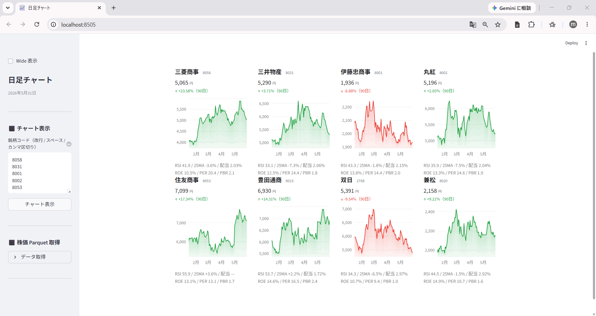

# 連載 1-2: 決算データを無料で集める（複数銘柄チャート比較）

連載記事: [決算データを無料で集める ― EDINET・TDnet の公式 XBRL を活用](https://minnanosaiban.github.io/hotline/blog/posts/01-02_collect_other_data/)

複数銘柄を4列カードグリッドで並べて比較する Streamlit アプリです。  
各カードに90日エリアチャート・RSI・25MA乖離率・PER / PBR / 配当利回りを表示します。



## ファイル

| ファイル | 種別 | 内容 |
|---|---|---|
| `app.py` | Streamlit アプリ | メインアプリ |
| `fetch_prices.py` | 株価取得 | yfinance で日足を取得して parquet に保存 |

## セットアップ

```bash
# このリポジトリは連載全体の 1 フォルダです
git clone https://github.com/minnanosaiban/blog.git
cd blog/01-02_1_chart_multi

# 依存パッケージをインストールして起動
pip install -r requirements.txt
streamlit run app.py
```

初回起動時はメイン画面に手順が表示されます。続けて下記「データの用意」を参照してください。

## データの用意

### 株価データ（yfinance）

アプリ内「⬛ データ取得」→「データ取得」を開き、**「株価を取得」** を押してください。

保存先: `data/prices/daily/{コード}.parquet`

> **再配布制限**: Yahoo Finance のデータは利用規約により再配布禁止です。

### 東証 銘柄一覧（data_j.xls）

TOPIX500 フィルタに使用します。

1. [JPX 公式](https://www.jpx.co.jp/markets/statistics-equities/misc/01.html) から「東証上場銘柄一覧」をダウンロード
2. `data/master/data_j.xls` に保存

> **再配布制限**: JPX が著作権を保有するデータのため再配布禁止です。

### 銘柄名

銘柄名は **`data_j.xls`（JPX 公式「東証上場銘柄一覧」）の「銘柄名」列** から表示します。上の手順で data_j.xls を置けば、そのまま名前が出ます（追加準備は不要）。

#### （任意）短縮名でコンパクトに見せたい場合

JPX の正式名称は長め（ホールディングス名・投資信託名など）で、一覧では折り返して読みづらくなりがちです。**短い表示名**で見栄えよく並べたいときは、自分で短縮名リストを作ると効果的です。

1. [トレーダーズ・ウェブ 株価一覧](https://www.traders.co.jp/market_jp/stock_list/price/all/all/1) を開く
2. 「コード」「銘柄名」をコピーし、`コード,銘柄` の2列で `data/master/stocks.csv` に保存
3. `stocks.csv` があれば、JPX 正式名より **こちらの短縮名が優先表示** されます

> **再配布について**: この短縮名リストは提供元（トレーダーズ・ウェブ）のデータのため、本リポジトリには同梱していません。各自でご用意ください。

### 証券会社の指標データ（任意）

PER / PBR / 配当利回りの表示に使用します。なくても RSI・25MA のみで動作します。  
証券会社のサービスから以下の CSV を取得し `data/` 直下に配置してください。

| ファイル名 | 内容 |
|---|---|
| `113_EPS.csv` | EPS実績 |
| `213_EPS.csv` | EPS予想 |
| `215_BPS.csv` | BPS予想 |
| `141_配当金.csv` | 配当金 |

> **再配布制限**: 証券会社が提供するデータは利用規約により再配布禁止です。

## ライセンス / 免責

ソースコードは MIT ライセンスです。データは各提供元の規約に従ってください。  
投資判断は自己責任でお願いします。
