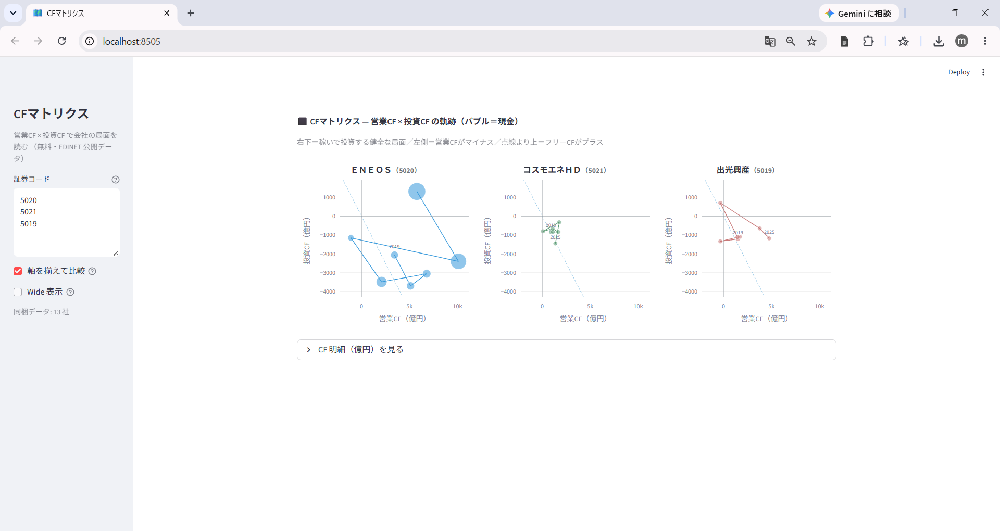

# 連載 1-3: 決算 XBRL を JSON に変換

連載記事: [決算 XBRL を JSON に変換 ― 「決算そのもの」を分析、元売3社を比較](https://minnanosaiban.github.io/hotline/blog/posts/01-03_xbrl_to_json/)

XBRL（決算短信・有報）を統一 JSON に変換し、それを使う **2 つの Streamlit アプリ**を収めています。

- **`app_cf_matrix.py`** … CFマトリクス（営業CF × 投資CF）を複数社並べて比較（連載 1-3）。EDINET 公開データだけで動く無料アプリ
- **`app.py`** … 決算 JSON から Note 記事の下書きプロンプトを生成（番外編）



## ファイル

| ファイル | 種別 | 内容 |
|---|---|---|
| `app_cf_matrix.py` | Streamlit アプリ | CFマトリクス（営業CF × 投資CF）を複数社並べて比較（連載 1-3） |
| `cf_matrix_core.py` | コア | CFマトリクスのデータ索引と Plotly 図生成（UI から分離・テスト可能） |
| `app.py` | Streamlit アプリ | 決算 JSON から Note 記事プロンプトを生成（番外編） |
| `fetch_kessan.py` | 決算短信 XBRL 取得 | TDnet から決算短信 XBRL を取得 |
| `fetch_tdnet.py` | 決算日時取得 | TDnet から決算発表日時を取得し `earnings.csv`（date, time, code）を生成 |
| `fetch_yuho.py` | 有報 XBRL 取得 | EDINET から有報 XBRL を取得 |
| `make_images.py` | Matplotlib チャート生成 | 有報 JSON から記事用の 7 年時系列チャート（売上 / 利益 / ROE / CF / CFマトリクス）を生成 |

## セットアップ

```bash
# このリポジトリは連載全体の 1 フォルダです
git clone https://github.com/minnanosaiban/blog.git
cd blog/01-03_xbrl_json

# 依存パッケージをインストール
pip install -r requirements.txt

# CFマトリクス（複数社を並べて比較・連載 1-3）
streamlit run app_cf_matrix.py

# 決算 Note プロンプト生成（番外編）
streamlit run app.py
```

## 使い方

1. `fetch_yuho.py`（有報・EDINET）または `fetch_kessan.py`（決算短信・TDnet）で XBRL を取得 → `data/xbrl/` に保存
2. アプリ起動時に自動で `data/json/` へ変換（下記「データの用意」の ⚠️ を必ず確認）
3. 銘柄コードを入力し、着目点を一言メモ → プロンプトを生成
4. Claude などの AI に貼り付けて下書きを作成

`fetch_tdnet.py` は決算発表日時を `earnings.csv`（date, time, code）に出力する独立スクリプトです（連載 1-2 の決算パターン分析などで使用。アプリ本体の動作には不要）。

```bash
python fetch_tdnet.py --start-date 2026-05-01 --end-date 2026-05-31
```

## データの用意

```
data/
├── xbrl/   ← 決算短信 ZIP / 有報 ZIP を配置（fetch_kessan.py / fetch_yuho.py が自動保存）
└── json/   ← アプリ起動時に自動変換（再配布禁止）
```

> **⚠️ XBRL → JSON 変換について**: 変換処理は著者環境のパーサー（`collectors`）に依存します。これが無い環境では変換は動きません。その場合は **事前変換済みの JSON を `data/json/` に直接置く**ことでアプリは動作します。

> **再配布制限**: EDINET / TDnet の開示データは提供元の規約により再配布禁止です。

## ライセンス / 免責

ソースコードは MIT ライセンスです。データは各提供元の規約に従ってください。  
投資判断は自己責任でお願いします。
