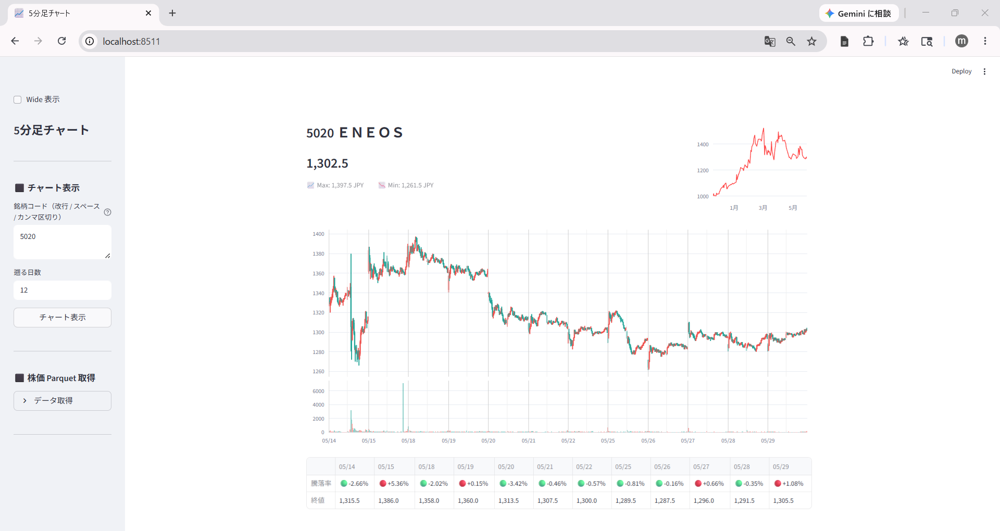

# 連載チャート01: 5分足チャート

連載記事: [まずは株価を取得しよう ― yfinance から parquet 保存、そしてチャートへ](https://minnanosaiban.github.io/hotline/blog/2026/05/18/01_get_stock_prices/)

複数銘柄の5分足ローソクチャートと騰落率テーブルを並べて表示する Streamlit アプリです。



## ファイル

| ファイル | 内容 |
|---|---|
| `app.py` | メインアプリ。ローカル parquet から読み込み |
| `app_simple.py` | 参考実装。yfinance から直接取得する簡易版 |
| `fetch_prices.py` | yfinance で株価を取得して parquet に保存 |

## セットアップ

```bash
pip install -r requirements.txt
streamlit run app.py
```

初回起動時はメイン画面に手順が表示されます。

## データの用意

### 株価データ（yfinance）

アプリ内「⬛ データ取得」→「データ取得」を開き、**「株価を取得」** を押してください。

保存先:
- `data/prices/daily/{コード}.parquet`（日足）
- `data/prices/5min/{コード}.parquet`（5分足）

> **再配布制限**: Yahoo Finance のデータは利用規約により再配布禁止です。

### 東証 銘柄一覧（data_j.xls）

TOPIX500 フィルタに使用します。

1. [JPX 公式](https://www.jpx.co.jp/markets/statistics-equities/misc/01.html) から「東証上場銘柄一覧」をダウンロード
2. `data/master/data_j.xls` に保存

> **再配布制限**: JPX が著作権を保有するデータのため再配布禁止です。

### 銘柄短縮名（stocks.csv）

`data/master/stocks.csv` はリポジトリに同梱（著者作成・再配布可）。

## ライセンス / 免責

ソースコードは MIT ライセンスです。データは各提供元の規約に従ってください。  
投資判断は自己責任でお願いします。
