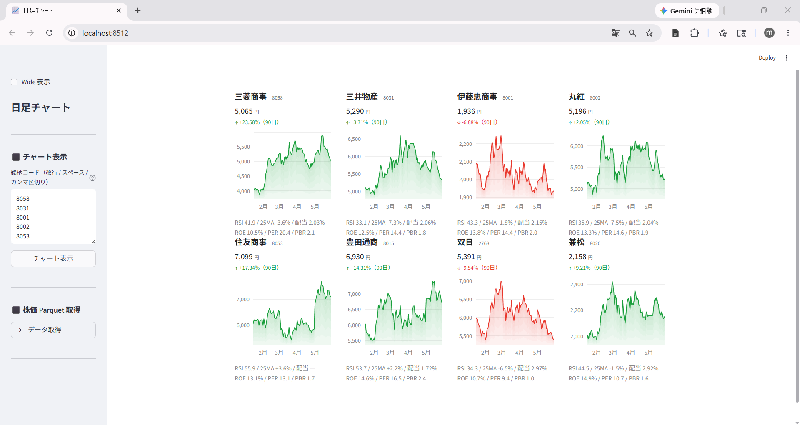

# 連載チャート02-1: 複数銘柄チャート比較

連載記事: [株価以外も取得しよう ― EDINET・TDnet・証券会社のアプリを活用](https://minnanosaiban.github.io/hotline/blog/2026/05/19/02_collect_other_data/)

複数銘柄を4列カードグリッドで並べて比較する Streamlit アプリです。  
各カードに90日エリアチャート・RSI・25MA乖離率・PER / PBR / 配当利回りを表示します。



## ファイル

| ファイル | 内容 |
|---|---|
| `app.py` | メインアプリ |
| `fetch_prices.py` | yfinance で日足を取得して parquet に保存 |

## セットアップ

```bash
pip install -r requirements.txt
streamlit run app.py
```

## データの用意

### 株価データ（yfinance）

アプリ内「⬛ データ取得」→「データ取得」を開き、**「株価を取得」** を押してください。

保存先: `data/prices/daily/{コード}.parquet`

> **再配布制限**: Yahoo Finance のデータは利用規約により再配布禁止です。

### 東証 銘柄一覧（data_j.xls）

TOPIX500 フィルタに使用します。

1. [JPX 公式](https://www.jpx.co.jp/markets/statistics-equities/misc/01.html) から「東証上場銘柄一覧」をダウンロード
2. `data/master/data_j.xls` に保存

> **再配布制限**: JPX が著作権を保有するデータのため再配布禁止です。

### 銘柄短縮名（stocks.csv）

`data/master/stocks.csv` はリポジトリに同梱（著者作成・再配布可）。

### 証券会社の指標データ（任意）

PER / PBR / 配当利回りの表示に使用します。なくても RSI・25MA のみで動作します。  
証券会社のサービスから以下の CSV を取得し `data/` 直下に配置してください。

| ファイル名 | 内容 |
|---|---|
| `113_EPS.csv` | EPS実績 |
| `213_EPS.csv` | EPS予想 |
| `215_BPS.csv` | BPS予想 |
| `141_配当金.csv` | 配当金 |

> **再配布制限**: 証券会社が提供するデータは利用規約により再配布禁止です。

## ライセンス / 免責

ソースコードは MIT ライセンスです。データは各提供元の規約に従ってください。  
投資判断は自己責任でお願いします。
